# agentic-evalkit Standalone Evaluation Framework Design

**Status:** Draft for user review

**Date:** 2026-07-02

**Repository:** `agentic-evalkit`

**Distribution:** `agentic-evalkit`

**Python package:** `agentic_evalkit`

**CLI:** `agentic-evalkit`

## 1. Objective

Build a standalone, host-neutral evaluation toolkit for agentic systems. A developer must be able to install one package and immediately discover, inspect, preview, and use suitable public datasets without manually finding files or writing importer code.

The framework must produce accurate, reproducible, and inspectable evaluation evidence. It separates dataset transport, sample projection, system execution, authoritative verification, grading, statistics, and reporting so each layer can evolve without invalidating the others.

The initial release must:

- include Hugging Face discovery and Dataset Viewer integration in the standard install;
- include a small curated catalog with `openai/gsm8k` as an objectively gradable quickstart and `princeton-nlp/SWE-bench_Verified` as a coding-agent preset;
- support local JSON, JSONL, CSV, and YAML datasets;
- provide typed, versioned contracts for samples, execution, grading, provenance, and reports;
- grade with deterministic or authoritative checks before model judges;
- calibrate any model judge used for gating;
- report uncertainty, errors, timeouts, abstentions, and repeated-trial reliability;
- provide a polished Python API, CLI, and portable JSON/JSONL/Markdown/HTML reports;
- run independently of Agentic Runtime Platform (ARP) and ExecutionKit (EK);
- design the official containerized SWE-bench verifier as an optional follow-on capability that does not require contract changes.

## 2. System Boundary

`agentic-evalkit` owns:

- dataset catalogs, providers, discovery, immutable resolution, preview, and cache;
- curated dataset and benchmark presets;
- typed evaluation samples and manifests;
- benchmark adapters and harness protocols;
- callable, subprocess, and HTTP execution-target protocols;
- objective graders, calibrated judge interfaces, and composite grading policy;
- aggregation, confidence intervals, paired comparisons, `pass@k`, and `pass^k`;
- run provenance, artifacts, reports, CLI, and extension interfaces.

It does not own:

- agent orchestration or workflow execution;
- ARP persistence, APIs, or UI;
- EK execution primitives or `executionkit.evals`;
- model-provider SDK policy;
- a public leaderboard service;
- host execution of untrusted benchmark code.

The dependency invariant is:

```text
agentic-evalkit -X-> agentic-runtime-platform
agentic-evalkit -X-> agentic-tools
agentic-evalkit -X-> executionkit

host application -> agentic-evalkit public contracts
agentic-evalkit -> huggingface-hub and Dataset Viewer APIs
```

ARP and EK remain unchanged. ARP can be evaluated through its existing callable, subprocess, or HTTP surfaces. When an ARP workflow already uses EK, the resulting platform behavior is evaluated after ARP returns a normalized response; `agentic-evalkit` never imports `executionkit.evals`.

## 3. Approaches Considered

### 3.1 Standalone host-neutral library and CLI — selected

The toolkit defines its own contracts and accepts injected execution targets. This maximizes reuse, makes clean installation testable, and avoids turning either ARP or EK into the evaluation owner.

### 3.2 ARP plugin repository — rejected

An ARP-specific plugin would retain framework coupling and eventually require ARP changes. It would also prevent other systems from using the dataset, grading, statistics, and report layers independently.

### 3.3 Full evaluation platform with its own orchestration server — rejected initially

A new server, scheduler, persistence layer, and interactive UI would duplicate host responsibilities before the core contracts and benchmark validity are proven. The initial product is a library/CLI with portable reports. A service can be considered after the public API stabilizes.

## 4. Reference Architecture

```mermaid
flowchart LR
  Dev["Developer: Python / CLI"] --> Manifest["Versioned EvalManifest"]
  Manifest --> Catalog["DatasetCatalog"]
  Catalog --> Local["Local provider"]
  Catalog --> HF["Hugging Face provider"]
  Local --> Source["Resolved source records"]
  HF --> Source
  Source --> Adapter["BenchmarkAdapter"]
  Adapter --> Sample["Typed EvalSample"]
  Sample --> Target["Callable / subprocess / HTTP target"]
  Target --> Result["NormalizedExecutionResult"]
  Result --> Verify["Objective grader or HarnessExecutor"]
  Result --> Judge["Optional calibrated model judge"]
  Verify --> Grade["GradeResult"]
  Judge --> Grade
  Grade --> Stats["Aggregation and statistics"]
  Stats --> Report["Provenance and portable reports"]
```



## 5. Core Contracts

Public contracts are immutable Pydantic v2 models with a `schema_version` and stable JSON representation. Protocols use standard Python typing so host adapters do not inherit framework classes.

### 5.1 `DatasetRef`

Identifies the requested source:

- provider;
- canonical dataset ID;
- requested revision;
- config and split;
- data files;
- filter or selection;
- field mapping;
- trust policy.

### 5.2 `ResolvedDataset`

Records the immutable source that will be used:

- canonical dataset ID;
- resolved commit SHA or content digest;
- config, split, and selected files;
- schema and row-count metadata;
- license, citation, gated-access, and dataset-card metadata;
- retrieval timestamp and provider response digests;
- cache manifest and checksums.

### 5.3 `EvalSample`

Contains:

- globally unique sample ID;
- input and optional reference answer;
- expected artifacts or state transitions;
- sample metadata and tags;
- source-row identity and digest;
- benchmark adapter name and version;
- allowed execution policy;
- grader specification.

Provider-native records never flow directly into execution or grading.

### 5.4 `NormalizedExecutionResult`

Contains:

- sample and attempt IDs;
- output, structured output, and produced artifacts;
- tool calls and trace references when supplied by the target;
- latency, tokens, cost, and model metadata when supplied;
- status: `completed`, `failed`, `timeout`, `cancelled`, or `error`;
- typed error and environment metadata.

### 5.5 `GradeResult`

Contains:

- grader name, type, and version;
- status: `pass`, `fail`, `partial`, `error`, `abstain`, or `unavailable`;
- numeric score when defined;
- hard-gate result;
- evidence and artifact references;
- rubric or oracle provenance;
- judge calibration reference when applicable.

### 5.6 `EvalRunManifest`

Pins:

- dataset and resolved revision policy;
- adapter and grader versions;
- execution target and target fingerprint;
- sampling, seed, attempt, timeout, and concurrency policy;
- artifact and redaction policy;
- environment and code fingerprints;
- baseline compatibility rules.

## 6. Dataset System

### 6.1 Provider protocol

Every provider implements:

- `search(query, filters, cursor) -> SearchPage`;
- `resolve(ref) -> ResolvedDataset`;
- `preview(dataset, offset, limit) -> SamplePage`;
- `iter_records(dataset, selection) -> AsyncIterator[SourceRecord]`;
- `healthcheck() -> ProviderHealth`.

Providers register through Python entry points. The initial package includes `local` and `huggingface`; later providers do not require edits to the catalog dispatcher.

### 6.2 Hugging Face baseline

The standard installation includes `huggingface-hub` and a lightweight Dataset Viewer client. It uses:

- Hub search and revision metadata;
- Dataset Viewer validity, configs, splits, schema, first rows, pagination, size, statistics, and Parquet metadata;
- explicit config and split on row requests;
- immutable commit resolution before a run;
- public access without credentials and standard `HF_TOKEN`/credential-store behavior for private or gated data;
- remote-code execution disabled by default;
- dataset card, license, citation, and access metadata in provenance.

Search, inspection, preview, and supported-file retrieval must not require `datasets`, `pyarrow`, a Git clone, Docker, or a manual browser download. Optional format plugins may add heavier dependencies without changing provider contracts.

The initial verified presets are:

- `openai/gsm8k`, config `main`, split `test`: runnable quickstart with normalized exact-answer grading;
- `princeton-nlp/SWE-bench_Verified`, config `default`, split `test`: discoverable, previewable, projectable, and prediction-export capable; authoritative grading requires the optional harness feature.

### 6.3 Cache

The content-addressed key includes provider, canonical ID, immutable revision, config, split, selected files, projection, filter, offset, limit, and loader schema version. Full datasets and pages are distinct cache record types.

Standalone use defaults to the platform user-cache directory. Every entry has a manifest and checksum. Offline mode only uses exact resolved entries. Corruption, staleness, and misses are explicit outcomes.

### 6.4 Dataset errors

Provider failures are typed, including not found, config required, split not found, access denied, license rejected, integrity failure, schema mismatch, unavailable provider, unsafe code required, rate limited, and offline cache miss.

Exceptions never collapse into an empty dataset. Zero rows is valid only after a successful provider response proves the selection is empty.

## 7. Benchmark and Harness Model

A dataset is not automatically a benchmark. `BenchmarkAdapter` binds:

- source-record projection;
- prompting or task policy;
- environment requirements;
- execution artifact format;
- authoritative grader or verifier;
- oracle validation;
- benchmark-specific aggregation.

The protocol supports `prepare`, `validate_oracle`, `grade`, and `aggregate`. Adapter metadata records the upstream benchmark version and compatibility policy.

### 7.1 SWE-bench Verified

The initial package ships:

- the dataset preset and row projection;
- typed repository, base-commit, issue, test-patch, fail-to-pass, and pass-to-pass fields;
- the official prediction export schema;
- versioned `HarnessRequest` and `HarnessResult` contracts;
- a deterministic fake `HarnessExecutor` for contract tests;
- capability preflight and a typed `authoritative_grader_unavailable` result.

The optional follow-on `swebench` extra supplies the pinned official Docker executor. It must record harness version, image digests, patch application, test logs, resolution status, resources, and typed infrastructure failures. It must pass one gold-patch and one intentionally invalid-patch smoke test through the same production path.

Generic rubric or similarity scoring must never be labeled `SWE-bench resolved`.

## 8. Execution Targets

The framework invokes systems through an `ExecutionTarget` protocol. Initial adapters are:

- `CallableTarget` for an injected sync or async Python callable;
- `SubprocessTarget` using structured JSONL over standard input/output with timeouts and bounded output;
- `HttpTarget` using a versioned request/response mapping, authentication hooks, retry policy, and trace correlation.

Targets return `NormalizedExecutionResult`. Framework code cannot branch on ARP or EK types. Host-specific adapters may live in separate packages or user code.

ARP can be evaluated without repository changes through its existing public process or HTTP surface. EK-backed behavior is evaluated only when the existing ARP workflow selects EK internally.

## 9. Grading and Rubrics

The grader planner uses the strongest valid evidence in this order:

1. authoritative benchmark verifier or state transition;
2. executable tests;
3. schema, type, or format validation;
4. exact or normalized deterministic comparison;
5. documented domain metric;
6. calibrated model judge;
7. human review.

Hard objective requirements cannot be averaged away by a model-judge score. Composite graders expose each component and gating rule.

Rubrics use atomic criteria with stable IDs, evidence requirements, weights, hard-gate flags, and explicit handling of missing evidence. Broad holistic scores are advisory only.

Model judges require a versioned calibration artifact containing model and prompt fingerprints, held-out human labels, confusion matrix, TPR, TNR, sample counts, thresholds, subgroup results when available, and expiry policy. An uncalibrated or expired judge cannot gate a release.

Judge execution supports structured output, bounded retries, parse-failure reporting, position/order checks, and abstention. The framework never silently converts judge errors into task failures.

## 10. Aggregation and Statistical Validity

Every report retains sample-level outcomes and reports:

- exact numerator and denominator;
- mean or rate with an appropriate 95% confidence interval;
- failure, error, timeout, abstention, cancellation, and unavailable-capability rates;
- paired deltas and paired intervals for compatible runs;
- `pass@k` when any successful attempt is useful;
- `pass^k` when consistent success is required;
- attempt counts, seed policy, and model sampling policy;
- latency, token, and cost distributions;
- predeclared subgroup slices with adequate sample sizes.

Runs are comparable only when dataset revision, split, adapter, harness, grader, target policy, and sampling policy are compatible. Incompatible comparisons fail with an explanation rather than producing a misleading delta.

Capability and regression suites are separate. Capability suites seek discriminating tasks; regression suites protect known-good behavior and require explicit promotion of cases.

## 11. Developer Experience

### 11.1 CLI

The command flow is:

```text
agentic-evalkit doctor
agentic-evalkit datasets curated
agentic-evalkit datasets search "coding agents" --provider huggingface
agentic-evalkit datasets inspect hf:princeton-nlp/SWE-bench_Verified
agentic-evalkit datasets preview ... --config default --split test --limit 3
agentic-evalkit datasets pull ... --revision <sha>
agentic-evalkit init --preset gsm8k
agentic-evalkit validate eval.yaml
agentic-evalkit run eval.yaml --limit 10
agentic-evalkit compare <run-a> <run-b>
agentic-evalkit report <run-id> --format html
```

`doctor` checks provider access, cache permissions, target reachability, optional capabilities, and judge calibration. Commands print the resolved revision, sample count, target, grading mode, and resource implications before execution.

### 11.2 Python API

The same application services power the CLI and Python API. Public APIs accept typed models, support async iteration, expose progress events, and never require CLI parsing or global state.

### 11.3 Reports

Reports are portable JSON, JSONL, Markdown, and self-contained HTML. They show provenance, compatibility, sample outcomes, grader evidence, trace/artifact links, uncertainty, and error categories. The HTML report supplies the initial inspect-and-compare UI without requiring a server.

## 12. Security and Governance

- Remote dataset code is disabled by default.
- Dataset identifiers, revisions, URLs, and paths are validated.
- Credentials are obtained through provider hooks and redacted from logs and artifacts.
- License and gated-access requirements are shown before retrieval.
- Subprocess output, artifact size, concurrency, retries, and time are bounded.
- Untrusted benchmark setup and code grading require an isolated harness.
- The official SWE-bench Docker boundary has no host-execution fallback.
- Reports support field-level redaction and identify potentially sensitive content.
- Dataset, adapter, grader, rubric, calibration, and manifest changes are versioned.

## 13. Packaging and Extension Model

The baseline wheel targets Python 3.11+ and includes Pydantic v2, Typer/Rich CLI support, PyYAML, and `huggingface-hub`. It must not depend on ARP, EK, `datasets`, `pyarrow`, Docker, or model-provider SDKs.

Optional extras are capability-oriented:

- `swebench`: official containerized SWE-bench execution;
- `judges`: selected model-provider adapters, while the core judge protocol remains provider-neutral;
- `parquet`: local bulk Parquet processing when Dataset Viewer/Hub paths are insufficient.

Providers, benchmark adapters, graders, reporters, and harness executors register through versioned Python entry-point groups. Plugin compatibility failures are explicit during discovery.

## 14. Validation Strategy

Implementation follows test-first red/green/refactor cycles. Required evidence includes:

- contract and serialization tests for every public model;
- provider tests with captured response fixtures and classified errors;
- live Hugging Face validity, split, preview, pagination, and immutable-resolution tests behind an explicit marker;
- cache key, corruption, offline, and concurrency tests;
- projection and property tests for samples;
- objective grader and hard-gate tests;
- judge parser and calibration metric tests;
- statistical tests against known synthetic distributions;
- callable, subprocess, and HTTP target contract tests;
- deterministic harness contract tests without Docker;
- optional SWE-bench gold/fail tests when Docker prerequisites exist;
- dependency-boundary tests forbidding ARP, `agentic-tools`, and EK imports;
- wheel build/install, import, quickstart, and CLI smoke tests in a clean environment outside all three repositories;
- Ruff, format, strict mypy, pytest coverage, and strict documentation gates.

Mocks prove local behavior but not live source integration. The initial release requires live Hugging Face evidence. The optional SWE-bench feature additionally requires authoritative Docker smoke evidence.

## 15. Delivery Slices

### Slice 1: Repository and architecture foundation

- Package skeleton, strict tooling, CI, documentation, and release metadata.
- Public contracts and extension entry points.
- Dependency-boundary and clean-wheel tests.
- Initial ADR set.

### Slice 2: Dataset foundation

- Local and Hugging Face providers.
- Curated catalog and verified GSM8K/SWE-bench presets.
- Immutable resolution, cache, errors, and CLI discovery workflow.

### Slice 3: Execution and objective grading

- Callable, subprocess, and HTTP targets.
- Normalized results, objective graders, composite hard gates, manifests, and artifacts.
- GSM8K end-to-end quickstart.

### Slice 4: Calibration, statistics, and reports

- Judge protocol and calibration artifacts.
- Confidence intervals, paired comparison, `pass@k`, and `pass^k`.
- JSON/JSONL/Markdown/HTML reporting and comparison workflow.

### Slice 5: Optional SWE-bench harness

- Pinned official Docker executor.
- Resource preflight, progress, cancellation, and evidence capture.
- Gold and invalid patch validation.
- No changes to core manifests, samples, results, or report schemas.

## 16. Architecture Decision Records

The implementation plan must create and review these ADRs before the affected production code:

1. `ADR-0001`: standalone repository and dependency boundary;
2. `ADR-0002`: immutable Pydantic contracts and schema-versioning policy;
3. `ADR-0003`: provider plugin model and baseline Hugging Face dependency;
4. `ADR-0004`: immutable dataset resolution and content-addressed cache;
5. `ADR-0005`: benchmark adapter versus harness-executor separation;
6. `ADR-0006`: execution-target protocol and ARP/EK non-dependency boundary;
7. `ADR-0007`: objective-first grading and calibrated-judge policy;
8. `ADR-0008`: statistical comparability and repeated-trial reporting;
9. `ADR-0009`: optional dependency and plugin compatibility policy.

Each ADR records context, decision, alternatives, consequences, validation evidence, and supersession policy. The implementation plan assigns ADRs to the slice where the decision first becomes executable and includes an ADR consistency check in the final documentation gate.

## 17. Acceptance Criteria

The initial release is complete when:

1. A clean environment installs the wheel and runs the CLI outside ARP and EK checkouts.
2. Static dependency checks prove there are no ARP, `agentic-tools`, or EK imports.
3. A developer can list curated datasets and search Hugging Face immediately after installation.
4. GSM8K and SWE-bench Verified configs/splits resolve from live Dataset Viewer metadata.
5. Search, inspection, preview, and supported retrieval work without `datasets`, `pyarrow`, Docker, or manual imports.
6. Every run pins immutable dataset and code provenance.
7. Provider failures remain typed and cannot appear as empty datasets.
8. GSM8K completes through a target and objective grader using one manifest across Python and CLI.
9. SWE-bench Verified can preview, project, and export official predictions without Docker.
10. Missing authoritative SWE-bench capability returns `unavailable`, never a substitute score.
11. Objective hard-gate failures cannot be offset by model-judge scores.
12. Uncalibrated judges cannot gate releases.
13. Reports separate task failure from infrastructure, timeout, abstention, cancellation, and unavailable capability.
14. Compatible runs produce paired comparisons with uncertainty; incompatible runs are rejected with reasons.
15. All required ADRs are accepted and consistent with code and documentation.
16. The clean-wheel, live-provider, CLI, typing, test, coverage, and documentation gates pass.

The optional SWE-bench feature is complete when a gold patch resolves and an invalid patch fails through the pinned official Docker path without changing initial public contracts.

## 18. Source-Derived Principles

The design is informed by:

- [OpenAI evaluation best practices](https://platform.openai.com/docs/guides/evaluation-best-practices);
- [OpenAI graders](https://platform.openai.com/docs/guides/graders/);
- [Anthropic agent evaluation guidance](https://www.anthropic.com/engineering/demystifying-evals-for-ai-agents);
- [Inspect dataset contracts](https://inspect.aisi.org.uk/datasets.html);
- [Harbor dataset adapters](https://www.harborframework.com/docs/datasets/adapters);
- [SWE-bench harness documentation](https://www.swebench.com/SWE-bench/reference/harness/);
- [Hugging Face Dataset Viewer](https://huggingface.co/docs/dataset-viewer/index);
- [Hugging Face Lighteval](https://huggingface.co/docs/lighteval/index);
- [Microsoft M365 Copilot Eval](https://github.com/microsoft/m365-copilot-eval);
- [OpenAI Evals](https://github.com/openai/evals), [Frontier Evals](https://github.com/openai/frontier-evals), and [simple-evals](https://github.com/openai/simple-evals);
- [Langfuse experiments](https://langfuse.com/docs/evaluation/experiments/experiments-via-ui);
- [Hamelsmu eval skills](https://github.com/hamelsmu/evals-skills/tree/main/skills);
- [DeepResearch Bench](https://arxiv.org/abs/2506.11763), [DeepResearch Bench II](https://arxiv.org/abs/2601.08536), and [RetroSearch](https://arxiv.org/abs/2506.06287).

Primary benchmark methodology and framework documentation take precedence over secondary summaries.

## 19. Non-Goals

- Modifying ARP or EK.
- Importing or replacing `executionkit.evals`.
- Migrating ARP's existing evaluation code into this repository during the initial release.
- Treating arbitrary Hugging Face data as a valid benchmark without an adapter and grader.
- Shipping Docker or the official SWE-bench harness in the baseline install.
- Executing untrusted dataset scripts or benchmark code on the host.
- Building a hosted multi-tenant service or public leaderboard initially.
- Reducing evaluation quality to a single aggregate score.

## 20. Decision

Proceed with `agentic-evalkit` as an independent repository, Python package, and CLI. Ship local and Hugging Face dataset providers in the baseline install, with a verified objective quickstart and a SWE-bench-ready adapter boundary. Keep ARP and EK unchanged and outside the dependency graph. Establish the ADR set before implementation and add the official containerized SWE-bench executor only as a contract-compatible optional feature.
