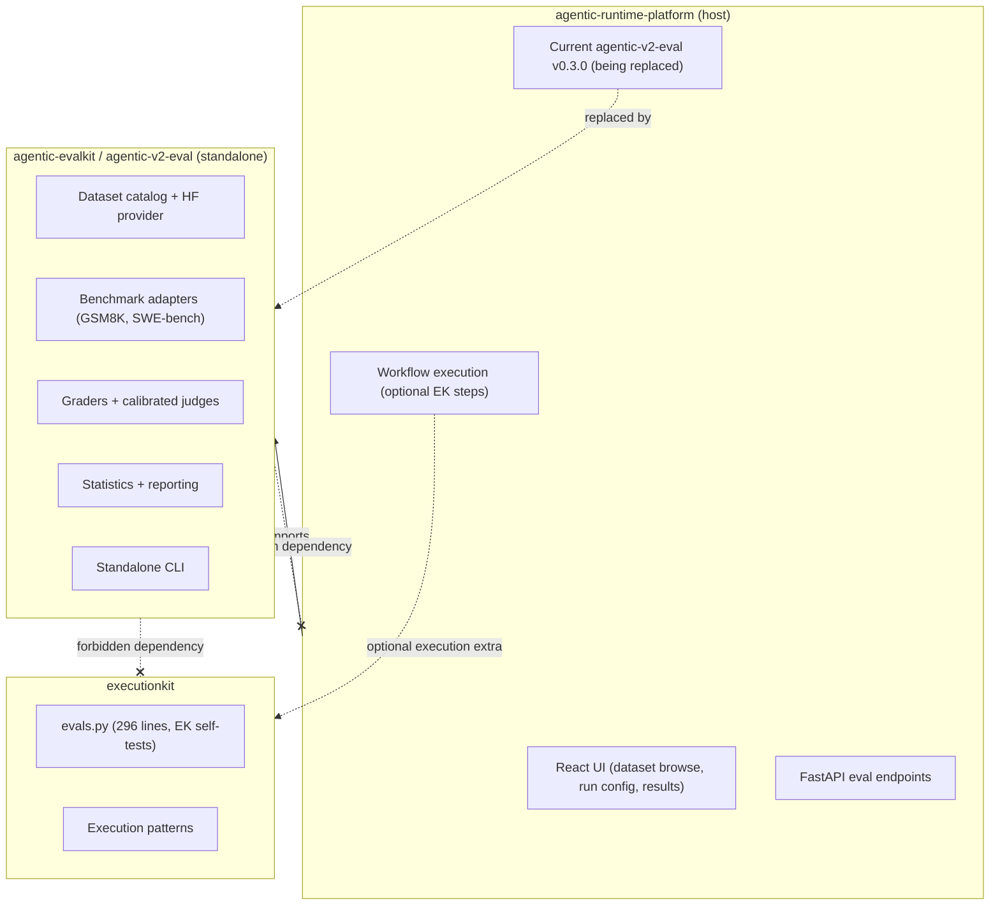
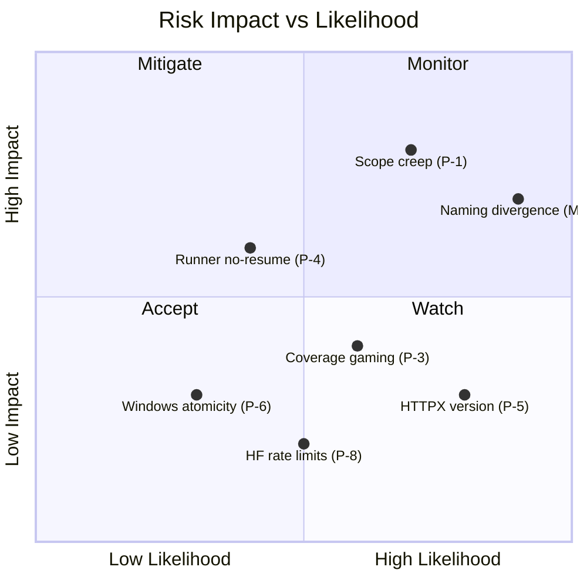

# agentic-evalkit — Design & Implementation Plan Evaluation Report

**Date:** 2026-07-02  
**Evaluator:** Automated Architecture Review  

**Documents Reviewed:**

| Document | Location | Size |
|---|---|---|
| [evalkit README](file:///c:/Users/tandf/source/agentic-evalkit/README.md) | `agentic-evalkit/` | 744 B |
| [evalkit Design Spec](file:///c:/Users/tandf/source/agentic-evalkit/docs/superpowers/specs/2026-07-02-agentic-evalkit-design.md) | `agentic-evalkit/docs/superpowers/specs/` | 24 KB, 490 lines |
| [evalkit Implementation Plan](file:///c:/Users/tandf/source/agentic-evalkit/docs/superpowers/plans/2026-07-02-agentic-evalkit-initial-release.md) | `agentic-evalkit/docs/superpowers/plans/` | 73 KB, 1,635 lines |
| [ARP Evaluation Framework Design](file:///c:/Users/tandf/source/agentic-runtime-platform/docs/superpowers/specs/2026-07-02-evaluation-framework-design.md) | `agentic-runtime-platform/docs/superpowers/specs/` | 42 KB, 714 lines |
| [agentic-v2-eval README](file:///c:/Users/tandf/source/agentic-runtime-platform/agentic-v2-eval/README.md) | `agentic-runtime-platform/agentic-v2-eval/` | 3.6 KB |
| [agentic-v2-eval pyproject.toml](file:///c:/Users/tandf/source/agentic-runtime-platform/agentic-v2-eval/pyproject.toml) | `agentic-runtime-platform/agentic-v2-eval/` | 1.3 KB |
| [ARP pyproject.toml](file:///c:/Users/tandf/source/agentic-runtime-platform/pyproject.toml) | `agentic-runtime-platform/` | 2.8 KB |
| ARP evaluation docs (5 files) | `agentic-runtime-platform/docs/evaluation/` | ~88 KB total |

**Associated Repositories Examined:**
- `agentic-runtime-platform` — Multi-agent AI orchestration monorepo (contains current `agentic-v2-eval`)
- `executionkit` — Sandboxed execution primitives (contains `executionkit/evals.py`)
- `executionkit-contracts` — Shared Pydantic v2 contract models

---

## Executive Summary

> [!IMPORTANT]
> **Recommendation: IMPLEMENT — with targeted modifications**

The `agentic-evalkit` design and implementation plan represent a **clean-room re-architecture** of the existing `agentic-v2-eval` package currently living inside the ARP monorepo. The companion [ARP-side evaluation framework design](file:///c:/Users/tandf/source/agentic-runtime-platform/docs/superpowers/specs/2026-07-02-evaluation-framework-design.md) explicitly documents the migration strategy: `agentic-v2-eval` is being refactored to standalone status, with ARP consuming it as an imported package rather than owning its internals.

The architecture is sound, the migration plan is coherent across both repos, and the design addresses **real, documented deficiencies** in the current eval code (broken HF loading, silent empty datasets, missing provenance, uncalibrated judges, no statistical rigor). However, there is a **naming divergence** between the two specs and some manageable delivery risks.

---

## 1. Ecosystem Context — How the Pieces Fit

### 1.1 The two-spec picture

The full story is told across **two companion design specs written on the same date**:

| Spec | Perspective | Package Name Used | Key Focus |
|---|---|---|---|
| [ARP Evaluation Framework Design](file:///c:/Users/tandf/source/agentic-runtime-platform/docs/superpowers/specs/2026-07-02-evaluation-framework-design.md) | From ARP's viewpoint | `agentic-v2-eval` | How ARP consumes the refactored eval package, the migration from existing code, API/UI integration, EK bridge normalization |
| [evalkit Design Spec](file:///c:/Users/tandf/source/agentic-evalkit/docs/superpowers/specs/2026-07-02-agentic-evalkit-design.md) | From the standalone package's viewpoint | `agentic-evalkit` | Standalone contracts, providers, graders, statistics, CLI — independent of any host |

Together they describe one coherent system:

### 1.2 What exists today in ARP (`agentic-v2-eval` v0.3.0)

The [current package](file:///c:/Users/tandf/source/agentic-runtime-platform/agentic-v2-eval/pyproject.toml) is a workspace member of the ARP monorepo with:

- **Dependency on `agentic-tools`** (workspace) — prevents standalone installation
- **Scorers**: `Scorer`, `ScoringResult` — YAML rubric loading, weighted scoring
- **Evaluators**: `PatternEvaluator`, `StandardEvaluator`, `QualityEvaluator`, LLM-as-Judge, `EvaluatorRegistry`
- **Reporters**: JSON, Markdown, HTML
- **Datasets**: Basic HF and local discovery (**documented as broken** — see §1.3)
- **Sandbox**: Subprocess sandbox with import blocklist
- **CLI**: `python -m agentic_v2_eval evaluate results.json`
- **~130 KB of scoring code** in `agentic_v2/scoring/` (evaluation_scoring, judge, multidimensional_scoring, etc.)
- **Server routes**: `GET /api/eval/datasets/*`, sample pagination, dataset-to-input mapping

### 1.3 Why the existing code needs replacement

The ARP-side design spec (§2.1) documents five concrete defects in the current HF loading path:

| # | Defect | Impact |
|---|---|---|
| 1 | Dataset Viewer requests **omit required `config=default`** → HTTP 422 | SWE-bench Verified returns zero rows |
| 2 | `huggingface_hub` fallback imports **undeclared `pyarrow`** | Crash on standard installs |
| 3 | Repo's `datasets/` directory **shadows** the `datasets` Python package | Import failure on the final fallback |
| 4 | Source failures **silently convert to empty list** | Infrastructure failure indistinguishable from empty dataset |
| 5 | Cache key **excludes revision, config, split, offset, limit** | Paginated response cached as complete dataset |

These are not minor bugs — they represent fundamental design flaws that the new architecture correctly addresses with typed errors (never empty on failure), content-addressed cache keys (including all parameters), and proper Dataset Viewer API usage.

### 1.4 What exists in ExecutionKit (`executionkit/evals.py`)

A lightweight 296-line harness for EK's own pattern testing:
- `EvalCase`, `EvalResult`, `EvalReport`, `Turn`, `ConversationScript`
- `run_eval_suite()`, `run_conversation_script()`, `live_provider_from_env()`
- 10 deterministic goldens, 13 failure cases, 4 live cases, 1 judge smoke calibration
- The weekly live eval is **documented as unhealthy** (3 most recent runs failed; judge scored a poor answer higher than a good answer)

Both specs correctly state that `executionkit.evals` remains EK's internal self-test and is **not** the platform evaluation engine.

---

## 2. Cross-Spec Consistency Analysis

### 2.1 Where the two specs agree ✅

| Aspect | Agreement |
|---|---|
| Standalone dependency boundary | Both: `eval package -X-> ARP, agentic-tools, EK` |
| HF in baseline install | Both: `huggingface-hub` in base wheel, no `datasets`/`pyarrow` |
| Provider protocol | Identical: `search`, `resolve`, `preview`, `iter_records`, `healthcheck` |
| Core contracts | Equivalent: `DatasetRef`, `ResolvedDataset`, `EvalSample`, `GradeResult`, `EvalRunManifest` |
| Grading hierarchy | Identical: 7-level evidence order, hard gates, calibrated judges |
| SWE-bench approach | Identical: adapter + prediction export now; Docker harness later |
| Delivery slices | Identical: Slices 1-4 initial, Slice 5 follow-on |
| Cache design | Identical: content-addressed, SHA-256, immutable revision in key |
| Error taxonomy | Identical: typed provider errors, never silent empty |
| Statistical reporting | Identical: Wilson CI, `pass@k/^k`, paired comparison |

### 2.2 Where the two specs diverge ⚠️

| Aspect | evalkit spec | ARP spec | Severity |
|---|---|---|---|
| **Package name** | `agentic-evalkit` / `agentic_evalkit` | `agentic-v2-eval` / `agentic_v2_eval` | 🔴 **High** — must be resolved before implementation |
| **CLI command** | `agentic-evalkit` | `agentic-v2-eval` (standalone) / `agentic eval` (ARP-mounted) | 🔴 **High** — follows from naming |
| **Repository location** | Separate repo (`agentic-evalkit/`) | Initially in ARP monorepo, extract later | Medium — ARP spec §4.2 says "remains in monorepo until API is proven" |
| **UI/API scope** | Not mentioned (library + CLI only) | Full API + React UI integration | Expected — evalkit spec is standalone-focused |
| **Migration plan** | §19 mentions "not migrating ARP code" as non-goal | §13 provides detailed 8-step migration plan | evalkit spec defers to ARP spec (correct) |
| **Normalized result type** | `NormalizedExecutionResult` | `NormalizedWorkflowResult` | Low — semantic difference; ARP normalizes from workflow, evalkit from generic target |
| **ARP server routes** | Not mentioned | Documented: eval endpoints, streaming, job management | Expected — evalkit doesn't own ARP's API |
| **Acceptance criteria** | 16 criteria (standalone) | 17 criteria (standalone + ARP integration) | Expected — ARP spec adds integration criteria |

> [!CAUTION]
> **The naming divergence is the most significant inconsistency.** The evalkit repo calls itself `agentic-evalkit` while the ARP spec calls the same conceptual package `agentic-v2-eval`. This must be resolved before implementation begins. Either:
> - **(a)** The standalone repo uses `agentic-evalkit` and ARP updates its spec to reference the new name, or
> - **(b)** The standalone repo is renamed to `agentic-v2-eval` to match the ARP spec, or  
> - **(c)** The ARP spec is updated to reference `agentic-evalkit` as the new identity (a clean break from the v2 naming)
>
> Option (a) or (c) is recommended — the `agentic-evalkit` name is cleaner, avoids the "v2" legacy coupling, and better represents a standalone identity.

---

## 3. Design Specification Evaluation

### Strengths

| Aspect | Assessment |
|---|---|
| **Contract system** (§5) | Excellent. Frozen Pydantic v2 models with `schema_version`, `extra="forbid"`, and string enums. The seven-status `GradeStatus` enum is better than most frameworks that collapse to boolean. |
| **Grading hierarchy** (§9) | Industry-leading. The seven-level evidence hierarchy with non-compensable hard gates is the correct design. Most frameworks skip to LLM judges. |
| **Statistical rigor** (§10) | Excellent. Wilson intervals, paired bootstrap, `pass@k` vs. `pass^k` distinction, and explicit comparability checks. |
| **Calibration enforcement** (§9) | Strong. The EK-side evidence (§2.2 of ARP spec) that the current live judge scored a poor answer higher than a good answer proves calibration enforcement is not theoretical — it's **urgently needed**. |
| **Error taxonomy** (§6.4) | Very good. Twelve typed errors fix the documented silent-empty-dataset defect. |
| **Security model** (§12) | Appropriate. Remote code disabled by default, credential redaction, bounded outputs. |
| **Migration strategy** (ARP spec §13) | Well-structured 8-step additive migration with temporary wrappers and deprecation windows. |

### Concerns

| # | Concern | Severity | Detail |
|---|---|---|---|
| D-1 | **Naming divergence** | 🔴 High | Two specs use different package names for the same conceptual product. See §2.2 above. |
| D-2 | **Overloaded initial scope** | Medium | Slices 1-4 in one release: contracts, two providers, cache, three targets, graders, stats, four report formats, complete CLI, 9 ADRs, and live verification. Ambitious for first release. |
| D-3 | **No versioned migration story for contracts** | Low | `schema_version: Literal["1"]` is defined, but no documented upgrade path for consumers when v2 arrives. |
| D-4 | **Missing async-first ADR** | Low | Provider protocol is async but no ADR explains why local file reading needs async. |
| D-5 | **`pass@k` formula edge cases** | Low | Combinatorial formula needs log-space computation for large `n`. |

---

## 4. Implementation Plan Evaluation

### Strengths

| Aspect | Assessment |
|---|---|
| **Test-first methodology** | Exemplary. Every task follows write-failing-test → verify-failure → implement → verify-pass. |
| **ADR-before-code sequencing** | Correct. The ADR-to-task mapping table ensures decisions are recorded before governing code. |
| **Commit granularity** | Good. One focused commit per task with meaningful messages. |
| **File separation** | Excellent. Models don't do I/O, providers don't grade, targets don't know benchmarks. |
| **CI matrix** | Appropriate: Python 3.11/3.12/3.13 on Ubuntu + Windows, clean-wheel job. |
| **Design coverage matrix** | Complete traceability from all design requirements to implementation tasks. |

### Risks

| # | Risk | Severity | Detail | Recommendation |
|---|---|---|---|---|
| P-1 | **Plan size vs. delivery** | High | 16 tasks, ~100 checkboxes, 73 KB. 3-6 week project. May exceed agentic context limits. | Split into 3 milestone PRs: Tasks 1-7, 8-12, 13-16. |
| P-2 | **Over-specified code snippets** | Medium | ~20 inline test files creates maintenance burden if design changes. | Accept as cost of agentic execution clarity, or move to `stubs/`. |
| P-3 | **Coverage target premature** | Medium | `fail_under = 90` from Task 1 may force gaming with small codebase. | Start at 80%, raise to 90% at Task 15. |
| P-4 | **No run resumption** | Medium | Runner doesn't support partial results on crash or checkpoint/restart for long runs. | Document as post-initial-release; design `EvalRunResult` to support appending. |
| P-5 | **HTTPX version constraint** | Medium | `HTTPX below 1` may already exclude current stable (HTTPX 1.0 released 2025). | Verify and update to `httpx>=1.0,<2` if needed. |
| P-6 | **No Windows atomicity note** | Low | `Path.replace()` is not atomic across Windows filesystems. Cache uses this. | Document in ADR-0004. |
| P-7 | **Typer version range** | Low | `typer<1` is broad. | Pin to `typer>=0.12,<1`. |
| P-8 | **Live test fragility** | Low | No retry/backoff for HF rate limits in live tests. | The weekly `live-provider.yml` workflow already handles this separately. |

---

## 5. Gap Analysis — Design vs. Plan vs. Acceptance Criteria

### evalkit spec acceptance criteria (§17)

| # | Criterion | Plan Coverage | Status |
|---|---|---|---|
| 1 | Clean install outside ARP/EK | Task 15, Step 4 | ✅ Covered |
| 2 | Static dependency checks | Task 15, Step 1 | ✅ Covered |
| 3 | List curated + search HF after install | Tasks 7, 14 | ✅ Covered |
| 4 | GSM8K + SWE-bench resolve from live Viewer | Task 6, Step 5 | ✅ Covered |
| 5 | No `datasets`/`pyarrow`/Docker for discovery | Task 15, Step 4 | ✅ Covered |
| 6 | Immutable provenance per run | Task 11 | ✅ Covered |
| 7 | Typed provider failures, never empty | Tasks 3, 5, 6 | ✅ Covered |
| 8 | GSM8K end-to-end through target + grader | Tasks 8, 9, 10, 14 | ✅ Covered |
| 9 | SWE-bench preview + project + predict without Docker | Task 8 | ✅ Covered |
| 10 | Missing harness returns `unavailable` | Task 8, Step 3 | ✅ Covered |
| 11 | Hard-gate failures not offset by judges | Task 10, Step 2 | ✅ Covered |
| 12 | Uncalibrated judges cannot gate | Task 10, Step 3 | ✅ Covered |
| 13 | Reports separate task/infra/timeout/abstain/cancel | Task 13 | ✅ Covered |
| 14 | Compatible runs → paired comparison; incompatible → rejected | Task 12 | ✅ Covered |
| 15 | All 9 ADRs accepted and consistent | Task 16, Step 2 | ✅ Covered |
| 16 | Clean-wheel + live + CLI + typing + coverage + docs gates | Task 15 | ✅ Covered |

**All 16 acceptance criteria have traceable plan coverage.**

### ARP spec additional criteria (§16, criteria 8-9, 16-17)

| # | Criterion | Plan Coverage | Status |
|---|---|---|---|
| 8 | Same manifest works across Python/CLI/ARP-CLI/API/UI | Partial — evalkit plan covers Python + CLI only | ⚠️ ARP-side integration is ARP's responsibility |
| 9 | EK-backed step produces same normalized boundary as native | Not in evalkit plan | ⚠️ ARP-side responsibility |
| 16 | Existing local workflows remain functional during migration | Not in evalkit plan | ⚠️ ARP-side responsibility — migration wrappers (ARP spec §13) |
| 17 | ARP backend + UI verification gates pass | Not in evalkit plan | ⚠️ ARP-side responsibility |

These gaps are **expected and correct** — they belong to the ARP-side implementation, not the standalone evalkit plan.

---

## 6. ADR Assessment

| ADR | Task | Assessment |
|---|---|---|
| 0001 — Standalone boundary | Task 1 | ✅ Essential. Validated by repo investigation and ARP spec §4. |
| 0002 — Immutable contracts | Task 2 | ✅ Essential. Frozen Pydantic models are correct. |
| 0003 — Provider plugins + HF baseline | Task 3 | ✅ Correct. Entry-point discovery is standard Python. |
| 0004 — Content-addressed cache | Task 4 | ✅ Correct. Fixes documented cache-key defect (ARP spec §2.1 item 5). |
| 0005 — Adapter/harness separation | Task 8 | ✅ Critical. Prevents generic scoring from claiming benchmark validity. |
| 0006 — Execution targets + ARP/EK boundary | Task 9 | ✅ Validates non-dependency invariant. |
| 0007 — Objective-first grading | Task 10 | ✅ Most important ADR. Addresses documented judge miscalibration (ARP spec §2.2). |
| 0008 — Statistical comparability | Task 12 | ✅ Prevents misleading cross-run comparisons. |
| 0009 — Optional dependencies/plugins | Task 1 | ✅ Clean extra groups. |

> [!TIP]
> Consider adding **ADR-0010: Async-first provider and target protocol** to document why the pipeline is async even for local providers.

---

## 7. Competitive Positioning

| Alternative | Strengths | Weaknesses vs. evalkit |
|---|---|---|
| **Current agentic-v2-eval v0.3.0** | Already built and integrated | Broken HF loading, silent empty datasets, no provenance, no calibration, no statistical rigor, coupled to ARP |
| **executionkit.evals** | Lightweight, zero-dep | Only 296 lines, unhealthy live eval, no dataset system |
| **AISI Inspect** | Mature, audited | Tied to Inspect's task model; no HF discovery; no ARP target adapters |
| **HF LightEval** | Native HF integration | Requires `datasets` + `pyarrow`; no calibrated judge protocol |
| **OpenAI Evals** | OpenAI ecosystem | OpenAI-specific; no provider abstraction |
| **Langfuse** | Production observability | SaaS-first; evaluation secondary to tracing |

**Assessment:** The case for building is strong. The existing `agentic-v2-eval` has documented, material defects. The new architecture fixes them while adding standalone portability, statistical validity, and calibration enforcement — capabilities no alternative provides for this ecosystem.

---

## 8. Recommended Modifications Before Implementation

### Critical (address before starting)

| # | Modification | Rationale |
|---|---|---|
| M-1 | **Resolve the naming divergence** | The evalkit repo uses `agentic-evalkit` / `agentic_evalkit` while the ARP spec uses `agentic-v2-eval` / `agentic_v2_eval`. Pick one name and update both specs. Recommend `agentic-evalkit` as it's a cleaner identity break. |
| M-2 | **Split into 3 milestone PRs** (Tasks 1-7, 8-12, 13-16) | Reduces blast radius, enables earlier feedback, prevents 73KB plan from going stale. |
| M-3 | **Verify HTTPX version constraint** | `httpx<1` may already exclude the current stable. Verify and adjust. |
| M-4 | **Add explicit Dataset Viewer fallback documentation** | Document that the `parquet` extra is the escape hatch for datasets the Viewer can't serve. |

### Recommended (address during implementation)

| # | Modification | Rationale |
|---|---|---|
| M-5 | **Start coverage at 80%, raise to 90% at Task 15** | Prevents coverage gaming in early tasks. |
| M-6 | **Add Windows path atomicity note to ADR-0004** | `Path.replace()` is not atomic across Windows filesystems. |
| M-7 | **Design `EvalRunResult` for future append/resume** | Even if post-initial-release, the model should not prevent it. |
| M-8 | **Add ADR-0010 for async-first pipeline** | Document the design decision. |
| M-9 | **Pin Typer minor version** | `typer>=0.12,<1` rather than `typer<1`. |

### Optional

| # | Modification | Rationale |
|---|---|---|
| M-10 | **Add `pass@k` log-space computation** | Avoids numerical overflow for large `n`. |
| M-11 | **Add live test retry/backoff** | Prevents transient HF rate limits from failing CI. |

---

## 9. Risk Summary

---

## 10. Final Verdict

| Dimension | Rating | Notes |
|---|---|---|
| **Strategic fit** | ⭐⭐⭐⭐⭐ | Fixes documented defects in current eval code. Upgrade from coupled v0.3.0 to standalone, rigorous framework. |
| **Architecture quality** | ⭐⭐⭐⭐⭐ | Clean boundaries, correct non-dependency invariant, protocol-based extensibility. Consistent across both specs. |
| **Design rigor** | ⭐⭐⭐⭐⭐ | Evidence hierarchy, calibrated judges, statistical validity — best-in-class. Motivated by real observed failures (ARP spec §2.1-2.2). |
| **Cross-spec consistency** | ⭐⭐⭐⭐ | Strong architectural alignment. Naming divergence is the main issue. |
| **Plan completeness** | ⭐⭐⭐⭐½ | All 16 standalone acceptance criteria traced. ARP-side integration criteria correctly deferred. |
| **Plan executability** | ⭐⭐⭐⭐ | TDD methodology is correct. Size creates delivery risk; milestone splitting mitigates. |
| **Migration coherence** | ⭐⭐⭐⭐ | ARP spec §13 provides clear 8-step migration. The evalkit plan correctly focuses on standalone delivery. |
| **Risk level** | ⭐⭐⭐⭐ | No fatal risks. Naming and scope are the primary concerns, both addressable. |

### Decision Matrix

| Option | Verdict | Reasoning |
|---|---|---|
| **Implement as-is** | ⚠️ Possible but naming must be resolved first | Both specs are sound but the package name conflict will cause confusion during integration. |
| **Implement with modifications** | ✅ **Recommended** | Apply M-1 through M-4 before starting. Resolve naming, split milestones, verify deps. The underlying design is excellent. |
| **Modify significantly** | ❌ Not warranted | The architecture is consistent across both specs. Major changes would reduce quality. |
| **Discard** | ❌ Not warranted | The current `agentic-v2-eval` has documented, material defects. The upgrade is justified. |

---

> [!TIP]
> **Suggested next step:** Resolve M-1 (naming) by deciding on the final package identity across both repos. Then apply M-2 (milestone split) and M-3 (HTTPX version check). Begin with Tasks 1-7 as the first deliverable — this gets dataset discovery and caching working end-to-end, which directly fixes the five documented HF loading defects.

---

## Appendix A: executionkit.evals — Details

`executionkit/evals.py` (296 lines, 10.6 KB):

| Symbol | Type | Purpose |
|---|---|---|
| `EvalCase` | `@dataclass(frozen=True)` | Single eval case: `name`, `run`, `check`, `metadata` |
| `EvalResult` | `@dataclass(frozen=True)` | Outcome: `name`, `passed`, `reason`, `metadata` |
| `EvalReport` | `@dataclass(frozen=True)` | Aggregate: `total`, `passed_count`, `failed_count`, `accuracy`, `summary()` |
| `Turn` | `@dataclass(frozen=True)` | Multi-turn conversation eval turn |
| `ConversationScript` | `@dataclass(frozen=True)` | Named sequence of `Turn`s |
| `run_eval_suite()` | async function | Runs `EvalCase`s sequentially, returns `EvalReport` |
| `run_conversation_script()` | async function | Drives conversation through `Kit` session |
| `live_provider_from_env()` | function | Builds provider from env vars |

Both specs correctly state this remains EK's internal self-test harness. The `EvalReport` vs. `EvalRunResult` naming distinction is not a conflict since they serve different purposes in different packages.

## Appendix B: Current agentic-v2-eval v0.3.0 — Details

Workspace package in [agentic-runtime-platform/agentic-v2-eval/](file:///c:/Users/tandf/source/agentic-runtime-platform/agentic-v2-eval):

**Dependencies:** `pyyaml>=6.0`, `agentic-tools` (workspace) — the workspace dependency is the core coupling being removed.

**Modules:** evaluators (5 files), metrics (accuracy/quality/performance), runners (batch/streaming), reporters (json/md/html), sandbox (local subprocess), datasets, adapters, rubrics, CLI

**ARP-side scoring code** (~130 KB in `agentic_v2/scoring/`): `evaluation_scoring.py` (38 KB), `judge.py` (22 KB), `multidimensional_scoring.py` (19 KB), `scoring_criteria.py` (20 KB), `step_scoring.py` (14 KB)

**ARP server eval routes:** `GET /api/eval/datasets`, sample pagination, dataset-to-input mapping

The ARP spec §13 documents the 8-step migration from this code to the new standalone package.

## Appendix C: ARP Migration Plan Summary (from ARP spec §13)

1. Define contracts inside `agentic-v2-eval` (the standalone package)
2. Move canonical dataset code from `tools.agents.benchmarks` → standalone; **remove `agentic-tools` dependency**
3. Turn old entry points into temporary wrappers importing the standalone package
4. Keep `agentic_v2_eval.datasets` as compatibility facade during migration
5. Preserve existing `repository` and `local` wire values with deprecation guidance
6. Migrate static `BENCHMARK_DEFINITIONS` into catalog presets
7. Route ARP execution through standalone execution-target protocol
8. Retain old query-parameter endpoints only during documented deprecation window

A dependency test will fail if the standalone package imports `agentic-tools`, `tools.agents`, ARP internals, `executionkit`, or `executionkit.evals`.
